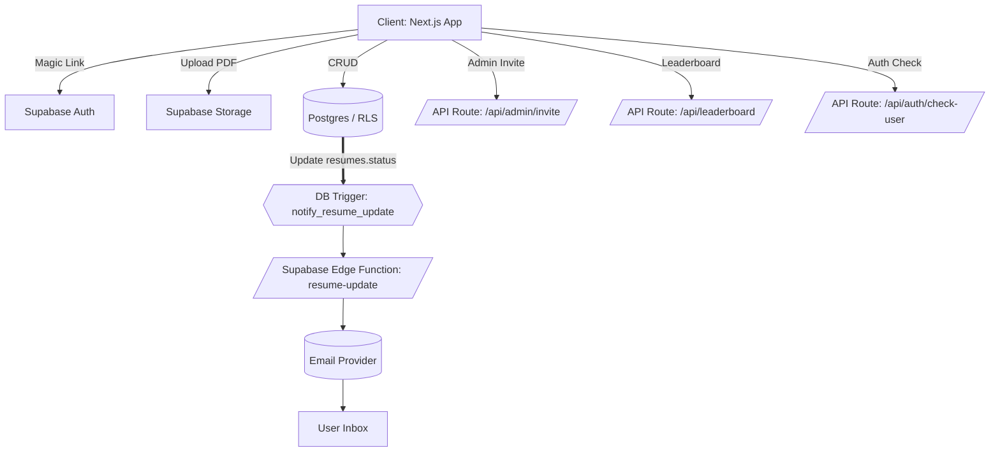

# Resume Submission and Review Platform

A production-ready resume intake and review system. Candidates upload PDFs and track status; admins review, score, and leave notes with an efficient workflow. Built on a modern, typed stack and deployable to Vercel in minutes.

## 🚀 Highlights

- **Delightful candidate experience**
  - Email notifications on resume status updates (Approved / Needs Revision / Rejected)
  - Passwordless Magic Link auth
  - Drag‑and‑drop PDF upload with client‑side validation
  - Status updates (Pending, Approved, Needs Revision, Rejected)
  - In‑browser preview and one‑click download
  - Public leaderboard

- **Fast reviewer workflow**
  - Unified review queue with filters and search
  - One‑click status changes, 0‑100 scoring, and notes
  - Clear stats and activity awareness
  - Inline preview and direct download

- **Secure by default**
  - Row Level Security (RLS) + policies
  - Private Storage with signed URLs
  - Strict TypeScript across client and API
  - Production‑grade Next.js 15 + React 19

## 🛠 Tech Stack

- **Frontend**: Next.js 15 (App Router), React 19, TypeScript
- **Backend**: Supabase (Postgres, Auth, Storage)
- **Styling**: Tailwind CSS
- **File Handling**: react-dropzone, react-pdf
- **Icons**: lucide-react
- **Deployment**: Vercel

## 🧱 Architecture at a Glance

- App Router with serverless routes under `src/app/api/*`
- SSR‑friendly Supabase client (`src/lib/supabase.ts`, `src/lib/supabase-server.ts`)
- Typed database models collocated with client helpers
- Clear request/response flows for updates and leaderboard
- Clear separation of concerns: UI components, hooks, and services




## 📦 Quickstart

1. **Clone the repository**
   ```bash
   git clone <repository-url>
   cd frontend
   ```

2. **Install dependencies**
   ```bash
   npm install
   ```

3. **Set up Supabase**
   - Create a new project at [supabase.com](https://supabase.com)
   - Copy your project URL and anon key
   - Run the SQL schema from `supabase-schema.sql` in your Supabase SQL editor

4. **Environment Variables**
   Create a `.env.local` file in the root directory:
   ```env
   NEXT_PUBLIC_SUPABASE_URL=your_supabase_project_url
   NEXT_PUBLIC_SUPABASE_ANON_KEY=your_supabase_anon_key
   SUPABASE_SERVICE_ROLE_KEY=your_supabase_service_role_key
   ```

5. **Run the development server**
   ```bash
   npm run dev
   ```

6. **Open**: [http://localhost:3000](http://localhost:3000)

## 👥 Roles & Permissions

- **Candidate**: Upload, preview, download own resumes; track status; appear on leaderboard once scored.
- **Admin**: Review all resumes, update status, score, leave notes, view stats.
- **Super Admin**: All admin capabilities plus admin invite via secure API route.

Admin invite is performed via the admin dashboard, which calls a protected route with server‑side policy checks.

## 🗄 Database Setup

Run the provided SQL schema in your Supabase SQL editor to create:

- `users`: Profiles with roles `user | admin | super_admin`
- `resumes`: Metadata, file URLs, status, score, notes
- `reviews`: Audit trail for scoring/notes (optional)
- Storage bucket: PDF assets (private by default)
- RLS policies: Least‑privilege access for users and admins
- Triggers: Timestamps and helpful defaults

## 🔐 Authentication

Passwordless authentication via Supabase Magic Links:
- Email‑based sign‑in with secure, expiring links
- Automatic profile creation and session management
- Serverless callback route wired for App Router

## 📁 File Upload

- PDF‑only, 10MB limit, client‑side validation
- Uploaded to Supabase Storage with scoped access
- In‑browser preview and reliable downloads

## 🎯 User Flow

1. **Sign Up/In**: User enters email, receives magic link
2. **Upload Resume**: Drag & drop or browse to upload PDF
3. **Track Status**: View submission status and scores
4. **View Leaderboard**: See how they rank against others

## 👨‍💼 Admin Flow

1. **Access Dashboard**: Navigate to `/admin`
2. **Review Submissions**: View all resumes with user details
3. **Score & Status**: Use quick actions or custom review
4. **Add Notes**: Provide feedback for candidates
5. **Track Statistics**: Monitor overall submission metrics

## 🔒 Security Model

- RLS enforced on all tables; policies restrict records to owners or admins
- Signed URLs for controlled file access to private storage
- Minimal surface API; privileged actions are server‑side routes only
- HTTP security headers set via `vercel.json` (e.g., X-Frame-Options, X-Content-Type-Options)
- Input validation on both client and server boundaries


## 🔁 Comparison (Why this approach?)

- Next.js + Supabase: fastest path to a typed, real‑time production app
- App Router + serverless routes: minimal backend boilerplate

## 🤔 Why Supabase instead of a custom Express backend?

- **Time‑to‑market**: Auth, Postgres, Storage, and policies are ready‑made. Avoid weeks of boilerplate (auth flows, uploads, RBAC, migrations, health checks).
- **Security by default**: Row Level Security and policies enforced in the database—safer than piecemeal middleware checks.
- **First‑class auth**: Passwordless magic links, OAuth providers, sessions, and admin tools out‑of‑the‑box.
- **Integrated storage**: Private buckets, signed URLs, and lifecycle rules without writing custom S3/GCS middleware.
- **Operational maturity**: Managed Postgres with backups, PITR, metrics, and observability—no ops pipeline to build.
- **Type safety**: Generated types and a typed client reduce integration drift compared to ad‑hoc REST + ORM stacks.
- **DX & tooling**: CLI, dashboard, SQL editor, and quick local dev loop; less infra code to maintain.
- **Cost & focus**: Fewer services to host and patch; spend time on product, not scaffolding.

When Express is a better fit: heavy custom business logic, complex multi‑service orchestration, non‑standard protocols, or strict control over runtime and network topology.


## 🔧 Configuration

### Supabase Configuration

1. **Authentication Settings**
   - Enable email auth
   - Set site URL for magic links
   - Configure email templates

2. **Storage Settings**
   - Create 'resumes' bucket
   - Configure file size limits
   - Set up access policies

3. **Database Settings**
   - Run the schema SQL
   - Enable RLS on all tables
   - Configure proper policies

## 📊 Feature Deep‑Dive

### File Upload Component
- Drag & drop interface
- Progress tracking
- Error handling
- File validation
- Preview functionality

### Review System
- Quick action buttons
- Custom scoring (0-100)
- Note taking
- Status tracking
- Bulk operations

### Email Notifications
- Automatic email on resume status change via Postgres trigger
- Supabase Edge Function receives webhook and sends email
- Configurable provider (e.g., SMTP/Resend/SendGrid) via environment variables

### Security Features
- Row Level Security
- File access controls
- User authentication
- Input validation
- XSS protection


## 📝 API Routes

- `GET /auth/callback` — Auth callback handler
- `POST /api/admin/invite` — Invite new admin (super admin only)
- `GET /api/leaderboard` — Public leaderboard data
- `GET /api/auth/check-user` — Server‑side auth guard helper

